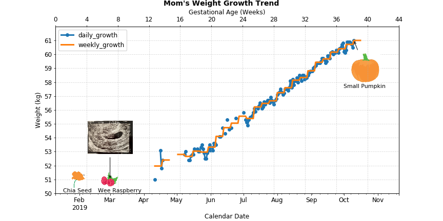

# JJs' Baby
:family: JJs' 2nd baby is coming :baby::maple_leaf::pig_nose:!!! It's still a BIG BIG BIG project. I'm a poor project planner. However, fight to be a wonderful mom (hope so). And there's also a "horrible" dad, who always thinks raising baby is as easy as playing games. It turns out raising the first one addes a lot of experiences while we still don't know how to handle two babies with only 3 years' age difference...

It comes by "accident" but we finally accept this surprise as it comes during the most difficult time of Shanghai Covid lockdown. I realize it's existence on Apr 1st, a very early stage and it grows pretty faster than I expected. It turns out to be a very strong baby.

Summarize all the issues here after closing!
# Table of Contents
<!-- MarkdownTOC -->

- [When waiting for baby](#when-waiting-for-baby)
	- [Skincare](#skincare)
	- [Names](#names)
	- [Daily tracking](#daily-tracking)
- [It's time!](#its-time)
	- [Delivery bag](#delivery-bag)
- [Baby is here!](#baby-is-here)

<!-- /MarkdownTOC -->
## When waiting for baby
### Skincare
Identify unfriendly skincare products by running [this](./skincare/identify_unfriendly_skincare_products.ipynb)
### Names
See the full list of names we came up with [here](./preparation/names.md)  
Final options -  

| 候选 | 男宝宝 | 女宝宝 | 终选 |
| --- | --- | --- | ---
| 大名 | | |
| 1 | 沈安隅 | 通用 | 
| 2 |  | 沈览月 |
| 小名 | | |
| 1 | 估估 | 通用 |
| 2 | 点点 | 通用 |
| 3 | 咯咯 | 通用 |
| 英文名 | | |
| 1 | Joey | 通用 |
| 2 |   | Jade | (too bitchy after watching why women kill)
| 3 | Eagle |  |    

### Daily tracking
Daily life has been packed with work, managing Zhunzhun, I feel so sorry that we can't have energy left for GuGu.

:woman: Mom's weight tracking :chart_with_upwards_trend:  

See raw [data](./tracking/daily_tracking.xlsx) and [notebook](./tracking/weight_growth.ipynb)

## It's time!
### Delivery bag
See the full checklist for both mom and baby [here](./preparation/delivery_bag.md)
### Labor and child birth
Timeline -   

## Baby is here!

