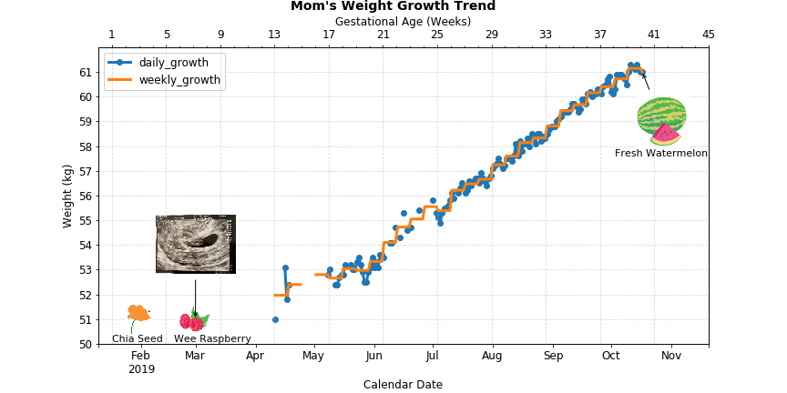

# JJs' Baby
:family: JJs' baby is coming :baby::maple_leaf::pig_nose:!!! It's a BIG BIG BIG project. I'm a poor project planner. However, fight to be a wonderful mom (hope so). And there's also a "horrible" dad, who always thinks raising baby is as easy as playing games. LET'S SEE!!!  

Summarize all the issues here after closing!
# Table of Contents
<!-- MarkdownTOC -->

- [When waiting for baby](#when-waiting-for-baby)
	- [Skincare](#skincare)
	- [Names](#names)
	- [Daily tracking](#daily-tracking)
- [It's time!](#its-time)
	- [Delivery bag](#delivery-bag)
	- [Labor and child birth](#labor-and-child-birth)
- [Baby is here!](#baby-is-here)

<!-- /MarkdownTOC -->
## When waiting for baby
### Skincare
Identify unfriendly skincare products by running [this](./skincare/identify_unfriendly_skincare_products.ipynb)
### Names
See the full list of names we came up with [here](./preparation/names.md)  
Final options -  

| 候选 | 男宝宝 | 女宝宝 | 终选 |
| --- | --- | --- | ---
| 大名 | | |
| 1 | 沈以歌 | 通用 | YES
| 2 |  | 沈览月 |
| 小名 | | |
| 1 | 小桔子 | 通用 |
| 2 | 点点 | 通用 |
| 3 | 咯咯 | 通用 |
| 4 | 准准 | 通用 | YES
| 英文名 | | |
| 1 | Joey | 通用 |
| 2 |   | Jade | (too bitchy after watching why women kill)
| 3 | Eagle |  |    

### Daily tracking
:man: Daddy's bedtime story :first_quarter_moon_with_face:  

| Date | Weeks | **Thu** | Fri | Sat | Sun | Mon | Tue | Wed |
| --- | --- | --- | --- | --- | --- | --- | --- | --- |
| 7/4/2019 | 25 |   |   |   |   |   | 母鸡和苹果树 |  
| 7/11/2019 | 26 | 爱美丽的小公鸡 | 豹子和老鼠的故事 | 蘑菇桌 | 奇怪的镜子 | 小螳螂学艺  | 咪咪的钓鱼竿 | 农夫与魔鬼 | 
| 7/18/2019 | 27 | 钉子 | 小恐龙卡卡 | 长不大的红杉树 | 小猪猪请客 | 聪明的小牧童  | 小狗穿鞋  |
| 7/25/2019 | 28 | 阿凡提的故事 |   |   |   | 星星的故事 | 三只小猪 | 长颈鹿和小乌龟 | 
| 8/1/2019 | 29 | 小象的鼻子 | 小熊布迪 | 盐和棉花 | 小兔乖乖 | 泥巴怪物 | 小青蛙的故事 | 小灰狼 | 
| 8/8/2019 | 30 | 两只毛毛熊 | 红蚂蚁和黑蚂蚁 | 豆豆兵去打仗 | 小乌鸦学艺 | 狐狸和鹤的酒宴 | 小蝌蚪画画 | 蚂蚁和蟋蟀 |
| 8/15/2019 | 31 | 小猴荡秋千 | 老虎与狮子聊天 | 美丽的小路 | 小龙虾的新衣服 | 心中的顽石 | 小白兔买盐 |  
| 8/22/2019 | 32 |   |   | 小象的鼻子(重) |  | 一只小老鼠 | 快乐晚会 | 天空将要塌下来了 | 
| 8/29/2019 | 33 | 小羚羊去避暑 | 猪和牛 | 狒狒的雨伞 | 车铃不响的自行车 | 两只小懒熊 |   | 马大哈平平 |
| 9/5/2019 | 34 | 糊涂的小老鼠 | 小青虫变蝴蝶 | 田鼠与家鼠 | 最好吃的蛋糕 | 麦穗的故事 | 会说话的卷心菜 | 
| 9/12/2019 | 35 | 糖葫芦 |   | 不睡觉的海豚 |   | 小马和小猫 | 好心的小白兔 | 羡慕仙鹤的花母鸡 | 
| 9/19/2019 | 36 | 白猫和花猫争鱼 |  | 迷路的小刺猬 | 聪明人 | 老天鹅 |   | 
| 9/26/2019 | 37 | 豌豆公主 |   |   |   |   |   |  
| 10/3/2019 | 38 | 萤火虫和小星星 | 书籍的妙趣 |   |   | 白白和黑黑 | | 想学本领的小猫 |
| 10/10/2019 | 39 |   | 餐桌上的悄悄话 |   |   | 小象的大鞋子 |   |  
| 10/17/2019 | 40 |   |   |   |   |   |   |  

:woman: Mom's weight tracking :chart_with_upwards_trend:  

See raw [data](./tracking/daily_tracking.xlsx) and [notebook](./tracking/weight_growth.ipynb)

## It's time!
### Delivery bag
See the full checklist for both mom and baby [here](./preparation/delivery_bag.md)
### Labor and child birth
Timeline -   
- 10/15  
10:00 pm: 褐色分泌物  
11:48 pm: 宫缩阵痛  
- 10/16  
8:00 am: 内检开半指，住院，从早上到下午宫缩频率不高，没有进步 
6:00 pm: 宫缩频率加快，达到5分以内一次，阵痛加强，以无心干其他事 
9:45 pm: 破水，阵痛加剧  
11:45 pm：开到快两指，准备进产房  
- 10/17  
12:00 am+: 推进产房，打无痛前内检已经开到四五指    
1:00 am+: 打上无痛，太累睡着了  
3:00 am+: 开到十指，导乐辅助调整宝宝位置，用了花生球，然后助产士接生  
4:13 am: 宝宝出生，亲密接触1小时  

## Baby is here!
It's a girl as I wish! Big surprise!
